# UD5-P1. Conexiones de redes y gestión de recursos en Linux

Escenario

Se simula una pequeña red local formada por dos equipos Linux que deben comunicarse entre sí y permitir la administración remota de un servidor.

La práctica se realizará utilizando:

    Ubuntu Server 24 (servidor)
    Ubuntu Desktop 24 (cliente)

Aunque el cliente dispone de entorno gráfico, todas las tareas deberán realizarse desde terminal.

El objetivo es aprender a configurar la red, verificar la conectividad, analizar el funcionamiento de la red y gestionar recursos accesibles a través de ella.
Infraestructura

Máquina 1 — servidor
sistema: Ubuntu Server 24
hostname: srv01
rol: servidor accesible por red y por SSH

Máquina 2 — cliente
sistema: Ubuntu Desktop 24
hostname: cli01
rol: equipo desde el que se realizan pruebas de conectividad y acceso remoto
Configuración de red

Ambas máquinas estarán conectadas a la misma red local.

Red:

192.168.50.0/24

Direcciones IP:

srv01 → 192.168.50.10
cli01 → 192.168.50.20

## E1. Identificación de interfaces de red

En cada máquina, muestra las interfaces de red disponibles ejecutando:

```bash
ip a
```
> Maquina cliente
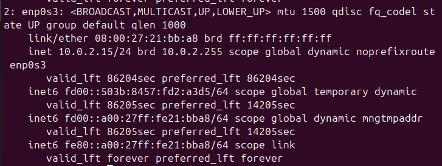

> Maquina servidor
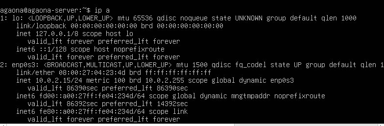


**¿Que interfaz de red está activa?**

La interfaz activa es enp0s3, ya que es la que tiene la conexión a la red.

**¿Qué dirección IP tiene asignada actualmente?**

En la maquina cliente tiene la dirección IP: 
10.0.2.15/24

En la maquina servidor tiene la dirección IP: 
10.0.2.15/24

**¿Qué dirección MAC tiene la interfaz?**

Cliente: 08:00:27:21:bb:a8 brd ff:ff:ff:ff:ff:ff

Servidor: 08:00:27:04:23:4d brd ff:ff:ff:ff:ff:ff

**¿A qué red pertenece la dirección IP?**

Ambas pertencen a la red 10.0.2.0/24

> He consultado la documentación usando únicamente el manual del comando ip en Ubuntu, con el comando:
```bash
man ip
```
Esto me permitió entender cómo se muestran las interfaces de red, las direcciones IP y la información asociada a cada interfaz.

## E2. Identificación de la configuración de red

Muestra nuevamente la configuración IP:
```bash
ip addr
```
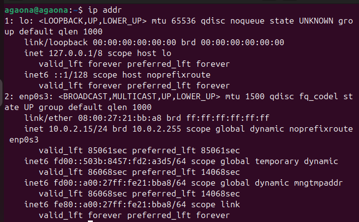
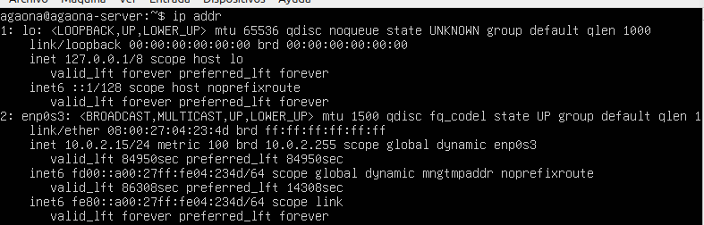


Muestra la tabla de rutas del sistema:
```bash
ip route
```

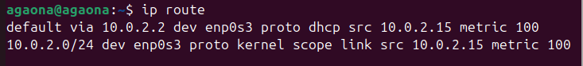
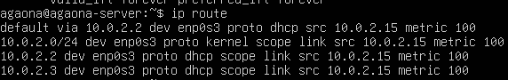

**¿Qué red local aparece configurada?**
Ambas aparecen con la red local: 10.0.2.0/24

**¿Qué interfaz se utiliza para acceder a esa red?**
enp0s3

**¿Existe una puerta de enlace configurada?**
**Incluye capturas y explica cada campo relevante que aparece en la información mostrada. Indica las fuentes utilizadas para comprender la información mostrada por estos comandos.**
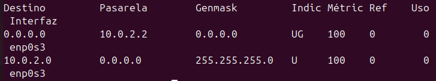

He usado el siguiente comando para consultar la puerta de enlace:
```bash
route -n
```
La puerta de enlace 10.0.2.2 es tu puente hacia el mundo exterior. Es el dispositivo al que tu equipo le entrega todo el tráfico destinado a Internet porque, por sí solo, no sabe cómo salir de tu red local. Sin esta dirección, estarías aislado y solo podrías comunicarte con los equipos que tienes justo al lado.

## E3. Configuración del nombre de host

**Consulta el nombre actual del sistema ejecutando:**
```bash
hostname
```
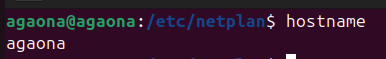
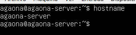

**Configura el nombre correspondiente.**

Servidor:
```bash
sudo hostnamectl set-hostname srv01
```
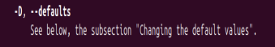
Cliente:
```bash
sudo hostnamectl set-hostname cli01
```
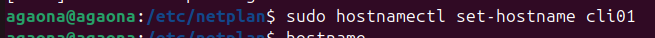

**Comprueba el cambio ejecutando:**
```bash
hostname
```
Cliente:

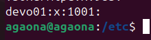

Servidor:

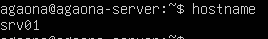

### Explicación comando "hostname"
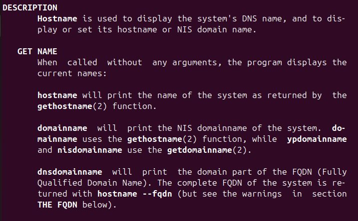
>El comando hostname es básicamente el carné de identidad de tu equipo en la red. Sirve para consultar o cambiar el nombre que identifica a tu sistema y su dominio, permitiendo que otros dispositivos sepan exactamente quién eres. Es la herramienta principal para gestionar tu nombre de máquina y asegurar que tu equipo sea reconocible dentro de cualquier red local o de internet


## E4. Configuración de dirección IP estática
**Edita el archivo de configuración de red:**
```bash
sudo nano /etc/netplan/01-netcfg.yaml
```

Cliente:

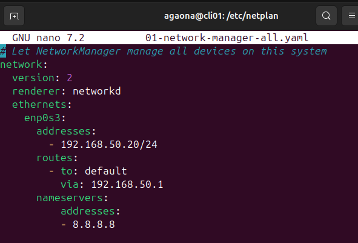

Servidor:
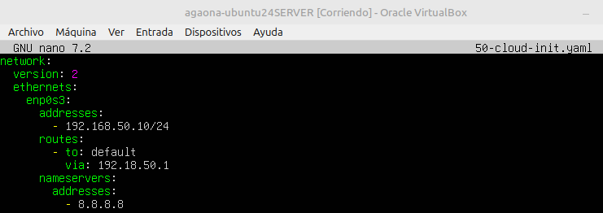

**Aplica la configuración:**
```bash
sudo netplan apply
```
Cliente:

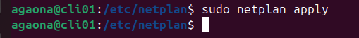

Servidor:

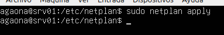

**Comprueba la configuración:**
```bash
ip a
```
Cliente:
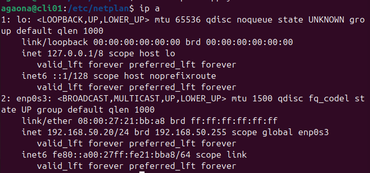

Servidor:
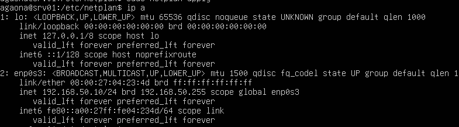

### Configuración de red con Netplan (IP estática)

```yaml
network:
  version: 2
  renderer: networkd

  ethernets:
    enp0s3:
      addresses:
        - 192.168.50.20/24

      routes:
        - to: default
          via: 192.168.50.1

      nameservers:
        addresses:
          - 8.8.8.8
```

### Explicación de cada parte

- **network:** Indica el inicio de la configuración de red.

- **version: 2**  
Define la versión del formato de configuración de Netplan.

- **renderer: networkd**  
Indica el servicio que gestiona la red.  
- `networkd` → Usado normalmente en servidores.  
- `NetworkManager` → Usado en sistemas con entorno gráfico.

- **ethernets:**  
Define las interfaces de red cableadas.

- **enp0s3:**  
Nombre de la interfaz de red configurada.

- **addresses:**  
Permite asignar una dirección IP manual.

- **192.168.50.20/24**  
Dirección IP estática con máscara de red `/24`.

- **routes:**  
Define la puerta de enlace (gateway).

- **to: default**  
Indica la ruta por defecto.

- **via: 192.168.50.1**  
Dirección IP del gateway o router.

- **nameservers:**  
Define los servidores DNS.

- **8.8.8.8**  
Servidor DNS público de Google.


### Documentación oficial consultada

- **Manual de Ubuntu:**
https://ubuntu.com/server/docs/explanation/networking/configuring-networks/#configuring-networks

## E5. Verificación de conectividad entre máquinas
Desde el cliente ejecuta:
```bash
ping 192.168.50.10
```
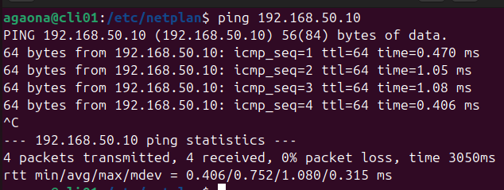

Desde el servidor ejecuta:
```bash
ping 192.168.50.20
```
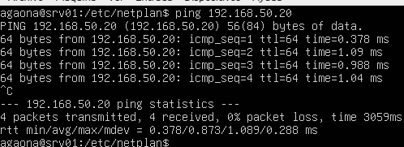

**Responde:**
- ¿Se reciben respuestas del otro equipo?

    Sí, se reciben respuestas correctamente, lo que indica que existe conectividad entre ambas máquinas.

- ¿Cuántos paquetes se envían y reciben?

    Se envían 4 paquetes y se reciben 4.

- ¿Qué información muestra el comando ping?
    
    Dirección IP de destino.
    Tiempo de respuesta (time=) en milisegundos.
    Número de secuencia (icmp_seq).
    Tiempo total (ttl).
    Estadísticas finales de paquetes enviados y recibidos.

### Documentación consultada
**Página oficial man (Linux):**

https://man7.org/linux/man-pages/man8/ping.8.html

Incluye capturas y explica el significado de los valores que aparecen en la salida del comando.

Indica las fuentes consultadas para comprender el funcionamiento de ping.